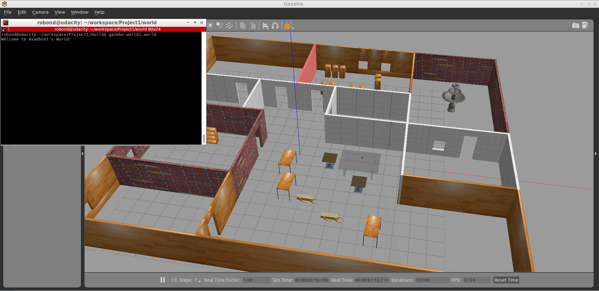

# Udacity Nanodegree: Robotics Software Engineer 
## Project 01/05 : Build My World 

### Directory Structure
```bash
Project1                     # Parent folder (/home/robond/workspace)
├── CMakeLists.txt                
├── LICENSE
├── model                          
│   ├── building             # Model of environment
│   │   ├── model.config
│   │   └── model.sdf
│   │── robodog              # Model of robot
│   │  ├── model.config
│   │  └── model.sdf
│   └── RoboLeg.STL          # CAD file of Robot's leg (made in SolidWorks)  
├── README.md 
├── script
│   └── hello.cpp            # Gazebo World plugin C++ script
└── world
    └── world1.world         # Gazebo World file (contains the above models) 
```

### Description
Designing a Gazebo world, including multiple models and writing a plugin which prints message ('Welcome to Avadhoot's world') in the terminal.
### Output



### Setup and run
#### Step 1
