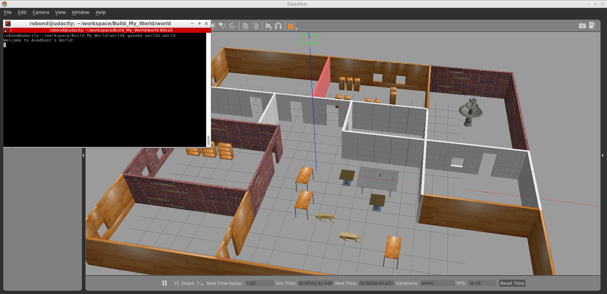

# Udacity Nanodegree: Robotics Software Engineer 
## Project 01/05 : Build My World 

### Directory Structure
```
Build_My_World                  # Parent folder
├── CMakeLists.txt                
├── LICENSE
├── model                          
│   ├── building                # Model of environment
│   │   ├── model.config
│   │   └── model.sdf
│   │── robodog                 # Model of robot
│   │  ├── model.config
│   │  └── model.sdf
│   └── RoboLeg.STL             # CAD file of Robot's leg (made in SolidWorks)  
├── README.md 
├── script
│   └── hello.cpp               # Gazebo World plugin C++ script
├── world
│    └── world1.world           # Gazebo World file (contains the above models) 
├── output
│   └── output.PNG
```


### Project Goals
Designing a Gazebo world which includes building, custom models, Gazebo online library model.

Writing a custom C++ plugin which prints message ('Welcome to Avadhoot's world') in the terminal upon launching the gazebo world.


### Output 


### Setup and run
#### Step 1 - Update the Workspace image
```
$ sudo apt-get update && sudo apt-get upgrade -y 
```

#### Step 2 - Clone the files in /home/workspace
```
$ cd /home/workspace/
$ git clone https://github.com/Avadhoot94/Build_My_World.git
```
#### Step 3 - Create a build directory and compile the code
```
$ cd /home/workspace/Build_My_World/
$ mkdir build
$ cd build/
$ cmake ../
$ make
$ export GAZEBO_PLUGIN_PATH=${GAZEBO_PLUGIN_PATH}:/home/workspace/Build_My_World/build
```

#### Step 4 - Launch the world file in Gazebo to load both the world and the plugin
```
$ cd /home/workspace/Build_My_World/world/
$ gazebo world1.world
```
